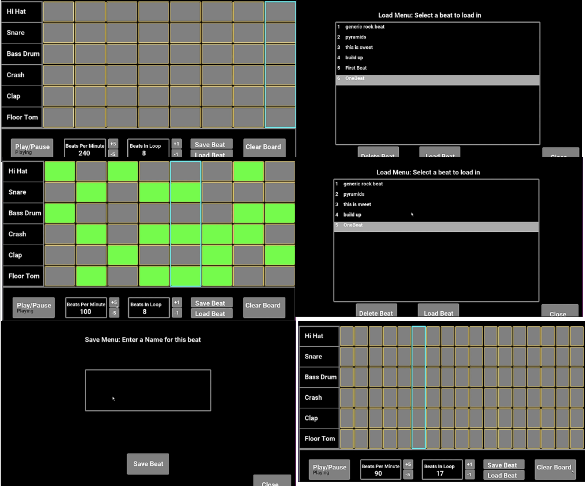

# PyBeatMaker
### Let's Breakout the block!!!

## 프로젝트 요약
 
> 2022.01.17 - 2022.01.21
 
> **Python 개인 프로젝트**
* 런치패드로 신나는 비트를 찍는 음악 유튜버들 처럼 파이썬 개발 환경에서 음악 비트를 찍는 것도 가능하지 않을까 하는 생각에 개발
* PyGame Package를 활용하여 제작
* 게임 화면창의 크기는 1400 * 800으로 설정
* 힙합에서 다양하게 사용하는 비트(킥, 스네어, 크래쉬, 톰, 클랩, 하이햇 등)의 음악샘플을 삽입
* 게임에서 주로 사용하는 글꼴은 Roboto-Bold를 사용
* 전반적인 패드 환경의 색은 검정색 배, 버튼은 회색, 테두리는 노란색, 찍은 비트 버튼은 연두색으로 설정
 

> **프로그램 설명**
* 처음 프로그램을 실행하면 클리어된 비트 메이커 화면 등장
* Hi Hat칸부터 Floor Tom칸의 비트를 무작위로 찍으면 해당 비트의 소리와 함께 버튼의 색깔도 초록색으로 바뀐다.
* 기본적인 BPM은 240, Beats In Loop은 8로 설정
  * BPM은 5씩 증가 => 속도 증가/감소
  * Beats In Loop은 1씩 증가 => 노트의 길이가 길어지거나/줄어든다.
* Save Beat는 비트 저장, Load Beat는 저장된 비트를 패드에 로드
  * 들어가게 되면 Save Beat, Load Beat, Delete Beat 세 개의 메뉴 등장
  * Save를 누르면 메뉴에 내가 설정한 비트 추가
  * Load를 누르면 내가 직접 추가한 비트를 패드 스크린에 등장
  * Delete를 누르면 내가 직접 추가한 비트를 삭제
* Clear Board를 클릭하면 찍어놓은 비트 모두 삭제
 

## 시연영상
https://youtu.be/REnAJhnGTkY

